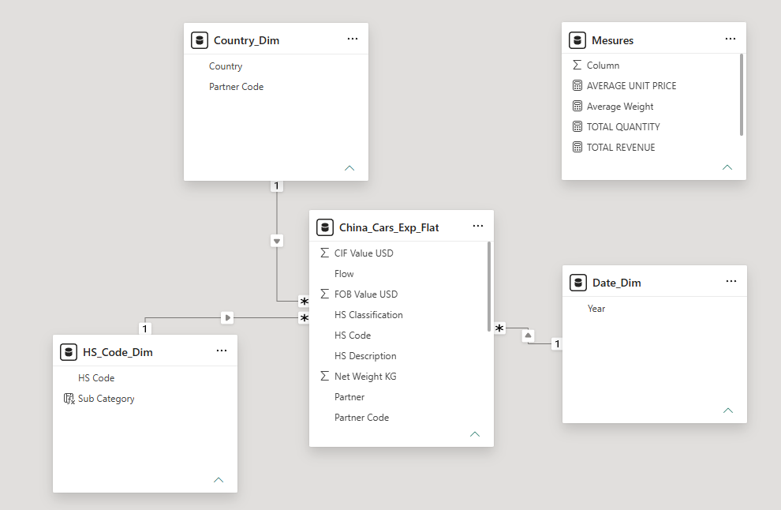
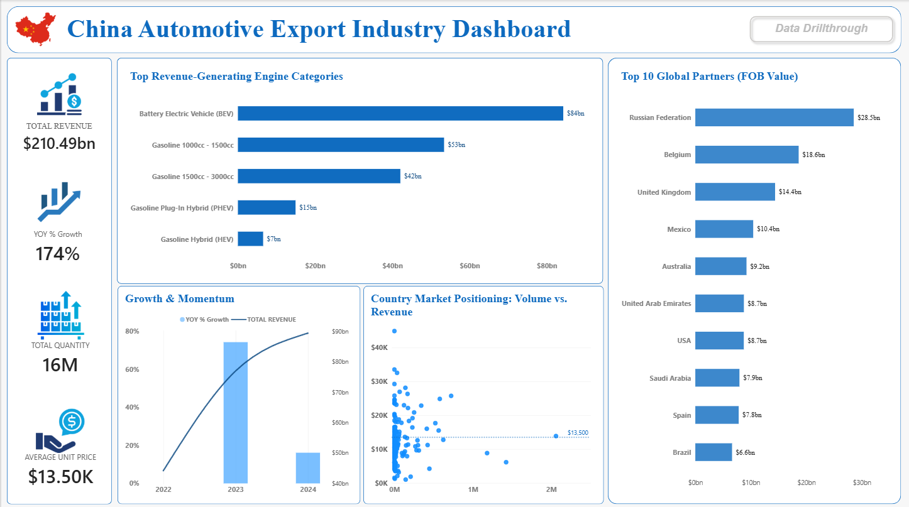

# China Automotive Export industry Dashboard 
## 📌 Overview
A Power BI project analyzing China's passenger car export trends from 2022 to the latest Data update using live trade data from the UN Comtrade REST API. This report explores the market transition from traditional internal combustion engine (ICE) vehicles to Electric (BEV) and Hybrid (PHEV/HEV) passenger cars across global export markets.
## 🌐 Data Source 
 -  **Provider:** [https://comtradedeveloper.un.org]
 -  **Target Data:** China's Passenger Vehicle Export .
 - **Access Method:** Web API connection using dynamic URL parameters and a standard subscription key. (Free API)
 - **Limitation:** Reporting lag of 1-2 years for official UN monthly trade updates.
## ⚙️ Data Cleaning & Transformation

- **Full Dataset Profiling:** Configured column profiling based on the entire dataset (rather than the default top 1,000 rows) to ensure complete data inspection across all annual records.

- **Data Quality & Error Validation:** Utilized Power Query Column Quality and Distribution tools to detect and handle blank values, errors, and formatting inconsistencies.

- **Data Type Casting:** Standardized schema by converting trade value fields to Currency and physical quantities and HS Codes to Whole Numbers for accurate mathematical operations.

- **Data Integrity Filtering:** Excluded China from the destination partner column to remove internal/self-trade records and maintain true export figures.

## 📐 Data Modeling & Star Schema Architecture

- **Dimension Table Creation:** Built dedicated dimension tables using DAX and M logic to support flexible filtering and slice-and-dice analytics:

- **Date_Dim:** Handles annual and temporal reporting functions.

- **HS Code Dim:** Stores detailed commodity code sub-categories (ICE, BEV, Hybrid).

- **Country_Dim:** Contains destination partner market details.

- **Key Measures:** A dedicated container table organizing all business calculation measures.

### 🔑 Key DAX Mesures 
```dax
YOY % Growth = 
 VAR CurrnetYearVal =[TOTAL REVENUE]
 VAR PriorYearVal= CALCULATE(
    [TOTAL REVENUE],FILTER(ALL(Date_Dim),Date_Dim[Year]=MAX(Date_Dim[Year])-1))
  RETURN
  DIVIDE(
    CurrnetYearVal-PriorYearVal,PriorYearVal,0)
```
```dax
TOTAL REVENUE = SUM(China_Cars_Exp_Flat[FOB Value USD])
```
```dax
TOTAL QUANTITY = SUM(China_Cars_Exp_Flat[Quantity])
```
```dax
AVERAGE UNIT PRICE = 
DIVIDE(
    SUM(China_Cars_Exp_Flat[FOB Value USD]),
    SUM(China_Cars_Exp_Flat[Quantity]),
    0)
```
- **Star Schema Implementation:** Designed a clean Star Schema by establishing single-direction (1:*) relationships between dimension tables and the central UN Comtrade export 
fact table.~

## 🛠️ Tools & Technology
- **Power BI Desktop:** Core platform used for star-schema data modeling, interactive dashboard visualization, and publishing analysis.

- **Power Query & M:** Used to extract trade data, parse JSON API responses, transform data types, and filter internal trade records.

- **DAX (Data Analysis Expressions):** Implemented custom calculations for time intelligence (YoY growth), market share percentages, and weighted average unit prices.

- **REST API:** Ingested annual trade records dynamically from the UN Comtrade database.
## 📊 Dashboard Features & Visuals

*Figure 1: Main Executive Overview page displaying top-level KPIs, powertrain distribution, and geographic trends.*

*Figure 2: Dedicated drill-through page providing granular country-level breakdowns and pricing trends.*

## 💡 Key Insights & Findings
- **Powertrain Revenue Leadership:**

1. Battery Electric Vehicles (BEVs) dominate global export revenue as the single largest engine category, generating $84bn in total trade value.

2. Traditional internal combustion engine (ICE) categories remain significant revenue contributors, led by mid-displacement models: Gasoline 1000cc–1500cc ($53bn) and Gasoline 1500cc–3000cc ($42bn).

3. Electrified hybrid options represented growing complementary segments, with Plug-In Hybrids (PHEV) accounting for $15bn and Standard Hybrids (HEV) generating $7bn.

- **2023 Global EV Export Surge:**

1. Electric Vehicle (EV) exports peaked with a massive 71% Year-over-Year (YoY) growth in 2023, representing the single largest annual expansion volume in China's automotive export history.

2. This surge served as the primary growth driver elevating China to the world's leading passenger vehicle exporter.

-**European Logistics & Key Import Hubs:**

1. Belgium and the United Kingdom emerged as premier European import destinations, leading EV import volume with 5.7K and 3.2K units, respectively.

## 💻 How to run the project

Follow these steps to replicate the environment, refresh the data pipeline, and explore the Power BI report locally.

### Prerequisites
* **Power BI Desktop:** Download and install the latest version of [Power BI Desktop](https://powerbi.microsoft.com/desktop/).
* **UN Comtrade API Subscription Key:** Register for a free API subscription at the [UN Comtrade Developer Portal](https://comtradeplus.un.org/) to access trade endpoint keys.

### Step-by-Step Setup

https://github.com/RialSofiane/Power-Bi-DashBoards.git

#### Step 2: Open the Report File
Open the file inside the project directory using **Power BI Desktop**.

#### Step 3: Insert Your API Key in the M Code
1. On the main top ribbon, click **Transform Data** to open the **Power Query Editor**.

2. On the top ribbon, click **Advanced Editor** (located in the *Home* or *View* tab).
5. Replace `"Put your API Key here "` with your actual secret UN Comtrade subscription key inside the quotation marks (e.g., `"65844fdfg84dfhj8454j"`).

6. Click **Done** at the bottom of the code window.
7. Click **Close & Apply** on the top left of the main Power Query window to save your changes and load the fresh data.
  